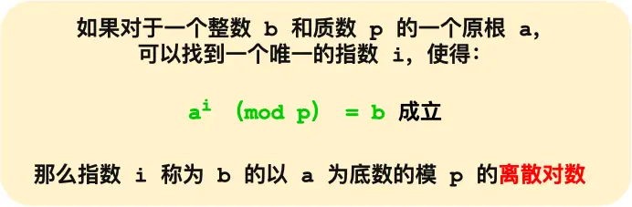

1. http协议是明文传输，安全上存在三个问题：
1.1 窃听风险，在通信链路上可以直接获取到明文信息
1.2 篡改风险，可以在通信链路劫持信息，篡改伪造信息
1.3 冒充风险，冒充真实网站
2. 为了解决安全问题，在http与tcp层协议间加上了tls协议（osi七层中的会话层），通过三种方式解决
2.1 信息加密
2.2 校验机制
2.3 身份证书
3. tls协议通过四次握手，2rtt时间建立信息安全通道

一、rsa算法
1. 传统的tls协议通过rsa算法来实现密钥交换
2. 用rsa算法握手过程
2.1 第一次握手：客户端发送client hello,发送客户端支持的tls版本，密码套件列表（Cipher Suite: TLS_RSA_WITH_AES_128_GCM_SHA256），生成的客户端随机数
2.2 第二次握手：服务端确认tls版本是否支持，选择一个密码套件，生成服务端随机数，发送sever hello，包含前面三个信息；随后为了证明身份，会发送server certificate消息，消息包含ca证书；最后发送server hello done消息，本次打招呼完毕
2.2.1 密码套件格式（TLS_RSA_WITH_AES_128_GCM_SHA256），两段，with前面有两段密钥交换算法_签名算法，这里都是rsa；with后是对称加密算法_摘要算法，对称加密算法是aes_128,分组模式是 GCM，摘要算法是sha256
2.3 第三次握手：客户端验证完证书后，认为可信，会创建一个新随机数 pre-master,用公钥加密，通过发送消息client key exchange给服务端；服务端用私钥解密后保存了第三个随机数；用三个随机数生成会话密钥，这个是对称密钥，用于http的请求响应加密；客户端发送change cipher spec消息，通知使用该方式加密；发送Encrypted Handshake Message消息，把之前的消息通过摘要算法生成摘要，然后用会话密钥加密，给服务端验证
2.4 第四次握手：服务端也会发送change cipher spec消息和encrypted handshake message消息，给客户端验证；双方都验证加解密没问题，握手完成

3. 身份证书
3.1 身份证书用来认证公钥持有者是否合法，也就是告诉客户端，服务端是否合法；证书由证书认证机构ca签名，ca是可信的，它给公钥签名，避免证书内容被修改
3.2 签名流程：ca会把公钥、用途、有效时间等打成一个包，hash计算到一个hash值，用自己的私钥对hash值加密生成身份证书
3.3 校验过程：客户端对身份证书加密的公钥进行同样的hash算法生成hash值h1；一般证书会在浏览器或操作系统集成ca的公钥，将服务端发来的证书用ca公钥解密生成h2，如果h1与h2相同，说明身份证书可信；
3.4 证书信任链：通常操作系统会保存根证书，也就是客户端只信任根证书，但通常我们申请的ca证书是中间证书签发的，需要向ca申请中间证书；如果请求到了中间证书，会用根证书验证中间证书，如果验证通过就认为中间证书可信
3.4.1 为什么需要中间证书？为了保证根证书的绝对安全性，将根证书隔离，不然根证书失守整个信任链都出问题

4. rsa算法的缺陷：不支持前向保密，一旦服务端的私钥泄漏，前面被劫持的所有tls加密消息都会破解；现在大多数网站使用的都是ecdhe密钥协商算法

二、ecdhe算法
1. rsa算法的前向保密问题就是在于私钥是固定的，一旦某次消息传输被破解了私钥，前面的所有加密消息都会被破解；那么让每次通信过程私钥都相互没有任何关系，那么就前向保密了
2. 基于的数学原理离散对数，在对数运算的基础上模运算 a^i (mod p) = b，底数a和模数p是公开的，知道对数i可以算出结果b，但是知道结果b推不出对数i

3. ecdhe算法利用了椭圆曲线性质，客户端服务端各生成一个随机数作为私钥a，与曲线的基点G计算得到公钥A=G^a(mod p)，交换各自的公钥，通过对方公钥与自己私钥的计算能得到椭圆曲线一点，因为私钥是随机、不公开的，所以能保证前向保密